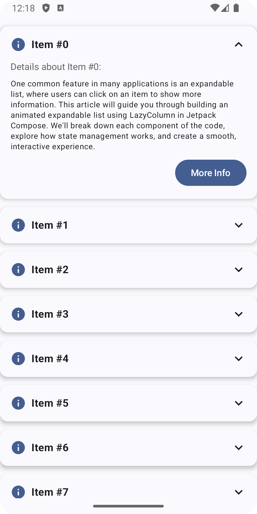
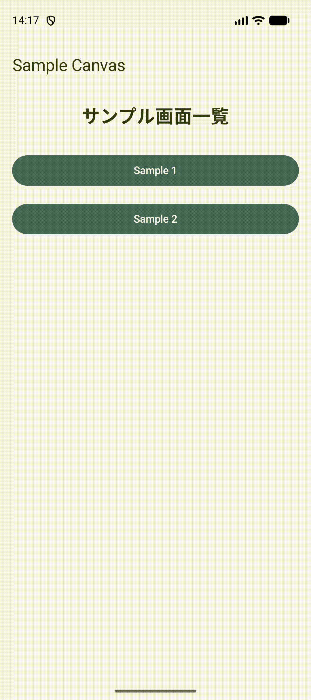

# compose-samples
Jetpack Compose のサンプル集

## user-rating-bar

ユーザー評価を表示する

参考記事: [Basic Android Compose - User Rating Bar](https://medium.com/deuk/basic-android-compose-user-rating-bar-6e0990b017f9)

 

## SampleAnimation

Jetpack Compose のアニメーションサンプル集。

参考記事: [10 Jetpack Compose Animations That Will Wow Your Users](https://medium.com/@hiren6997/10-jetpack-compose-animations-that-will-wow-your-users-6dda5342a567)

## SampleList

Jetpack Compose の List のサンプル集。

参考記事: [Jetpack Compose 8: List and Grid Components with Examples](hhttps://medium.com/@ashfaque-khokhar/jetpack-compose-8-list-and-grid-components-with-examples-1ae952decca0)  

  

   

参考記事: [Building a Custom Animated Expandable/Collapsed List Component with Jetpack Compose Using LazyColumn](https://medium.com/@ramadan123sayed/building-a-custom-animated-expandable-list-with-jetpack-compose-1774a9328a32)  

  

   

参考記事: [Jetpack Compose LazyColumn Sticky Header: Complete Implementation Guide](https://medium.com/softaai-blogs/jetpack-compose-lazycolumn-sticky-header-complete-implementation-guide-a102c9b4f2a6)  

  

## SampleCanvas

Jetpack Compose の Canvas API サンプル集。

